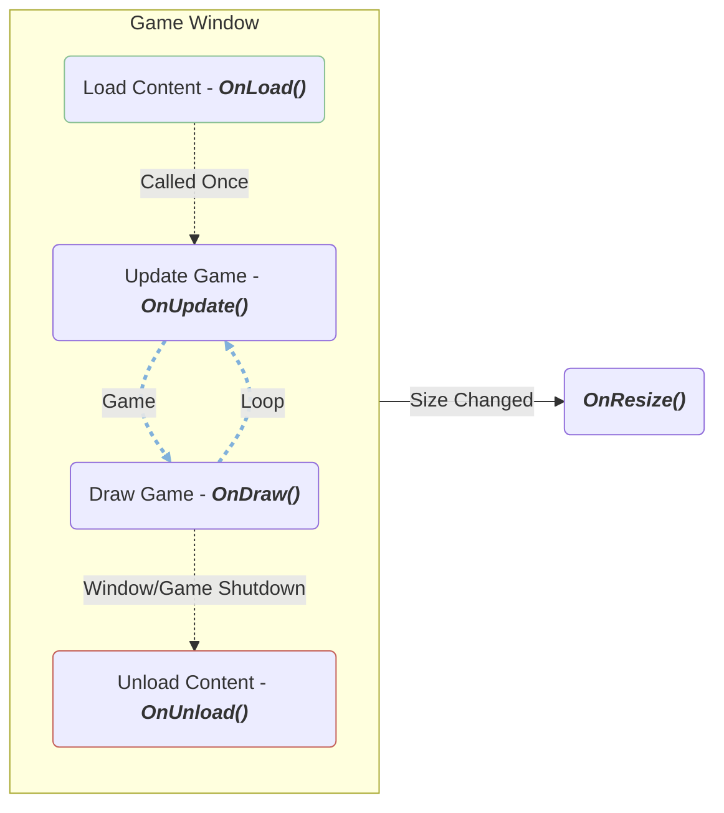

import Tabs from '@theme/Tabs';
import TabItem from '@theme/TabItem';
import GuideLink from "@site/src/components/GuideLink";
import Url from "@site/src/components/Url";

# Manually Setup Project

This guide will show you how to manually create a Velaptor application.

:::note Guide Source Code
There are plans in the future to create a project template for <Url href="visualstudio.microsoft.com/" text="Visual Studio" openInNewTab="true"/> and
<Url href="www.jetbrains.com/rider/" text="JetBrains Rider" openInNewTab="true"/> users to easily create a basic Velaptor application.
:::

First things first. You have to create a project with your preferred IDE!!

## <span className="color-step">Step 1: Create the application</span>

Create a new C# console application using dotnet version specified in the `EmptyProject.csproj`, look for the `<TargetFramework></TargetFramework>` XML tag.


## <span className="color-step">Step 2: Add Velaptor to the project</span>

Add the Velaptor <Url href="www.nuget.org/packages/KinsonDigital.Velaptor" text="NuGet package" openInNewTab="true"/> to the project.
   - Make sure to click the preview check box in your IDE of choice. Since Velaptor is currently in preview, clicking the checkbox will allow you to see the NuGet package.
    <Tabs>
       <TabItem value="vs" label="Visual Studio" default>
            
        </TabItem>
        <TabItem value="banana" label="JetBrains Rider">
            
        </TabItem>
    </Tabs>


## <span className="color-step">Step 3: Create main classes</span>

The game class is the class used to contain all of the game loop/lifecycle methods.  These are the update and render methods,
the load and unload content methods and more.

### <span className="color-sub-step">3.1: Create game class</span>

Create a new class file named `Game`. This will be necessary to take advantage of the game-related methods of Velaptor. These methods
are used for things such as loading and unloading content, updating your game objects, and rendering graphics to the screen.

```csharp
namespace HelloVelaptor;

public class Game : Window
{
}
```

:::tip Top Level Statements
Top-level statements are a newer feature added in C#10 that enables you to avoid the extra ceremony of creating the `main` entry point method
in a class.
Click <Url href="learn.microsoft.com/en-us/dotnet/csharp/whats-new/tutorials/top-level-statements" text="here" openInNewTab="true"/> to learn more!!
:::


### <span className="color-sub-step">3.2: Create app entry point</span>

All applications need some kind of entry point.  This is the starting point of your application.  In the case of Velaptor as well as
all C# applications, the entry point is the `main` method in the `Program` class.  Let's take advantage of the latest C#
features and use top-level statements.  Create a new `Program.cs` file and add the following code:

```csharp
var game = new EmptyProject.Game();
game.Show();
```

## <span className="color-step">Step 4: Creating game methods</span>

When developing games, you need to take advantage of various methods that are _**hooked**_ into
various parts of the game lifecycle. These lifecycle events are things such as content loading,
content unloading, updating, drawing, etc.

Here is a diagram that shows the lifecycle of a Velaptor game.



### <span className="color-sub-step">4.1: Create `OnLoad()` method</span>
Once the game class file has been created, we need a way to load content. We can load sounds, textures, fonts, atlas textures and atlas data, or any
kind of content your game needs. This method will be invoked once time as the application loads up.

Create a method override of the `Window.Load()` method in the `Game` class as shown below:

```csharp
protected override void OnLoad()
{
    base.OnLoad();
}
```

### <span className="color-sub-step">4.2: Create `OnUpdate()` method</span>

The next method to create is the `OnUpdate()` method. This method will be invoked once every frame and always before the `OnDraw()` method is
invoked. This is where you should add your game logic and update your game state. The point of
this method is to add _**behavior**_ to your game. Think of it as the brains of your game.

```csharp
protected override void OnUpdate(FrameTime frameTime)
{
    base.OnUpdate(frameTime);
}
```

### <span className="color-sub-step">4.3: Create `OnDraw()` method</span>

Now that we have a way to update our game state, we need to create a method to render our game to the screen. Create a method override of the `Window.OnDraw()` method.
The `OnDraw()` method is invoked once every frame and always after the `OnUpdate()` method is invoked.
The point of this method is only for rendering your game to the screen.

```csharp
protected override void OnDraw(FrameTime frameTime)
{
    base.OnDraw(frameTime);
}
```

### <span className="color-sub-step">4.4: Create `OnResize()` method</span>

If you want your game to react when the window size changes, you can create an override method using the `Window.OnResize()` method.
The `OnResize()` method is invoked anytime the window's size is changed, including minimizing, maximizing, and restoring it.
This is a great location to run game logic that can do anything your game needs. One good example is to pause your game automatically
when minimized and to unpause when the window is maximized or restored.

```csharp
protected override void OnResize(SizeU size)
{
    base.OnResize(size);
}
```

### <span className="color-sub-step">4.5: Create `OnUnload()` method</span>

We need a way to unload our content. This can be performed by creating a method override of the `Window.OnUnload()` method.
The `OnUnload()` method is invoked one time when the window is closed. This is to free resources and content from your game on
the CPU side as well as loaded textures from the GPU. This is also where scene management unloading can be performed.

```csharp
protected override void OnUnload()
{
    base.OnUnload();
}
```

## <span className="color-step">Step 5: Run it</span>

Run the application!!


I know it isn't much, but we will get there. 💪🏻
