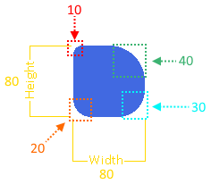

import GuideLink from "@site/src/components/GuideLink";
import Link from "@docusaurus/Link";
import ClrText from "@site/src/components/ClrText";

# Rendering Rectangles

:::note Guide Source Code
Go to the <GuideLink projectName="Rectangles" version="v1.0.0-preview.36"/> guide project to see the source code for a fully working example of this guide.

This guide will not show you every step relative to the guide project.  
It will show you the most important information related to rendering rectangles only.  
The guide project uses the majority of the concepts discussed in all of the previous guides.
:::

Rendering primitive shapes is a fundamental part of game development.  They can be used to create custom UI elements,
be used for guides and tutorials, and even be used for debug drawing.

What is debug drawing you ask?

Debug drawing is the process of drawing shapes to the screen to help you debug your game.  For example, you could draw
a rectangle for a sprites bounding box to help you see where the sprite is on the screen which can help with debugging
issues with collision detection.

In this guide, you will learn how to render rectangles to the screen using _**Velaptor**_.

The rectangle has different attributes that you can set to customize how the rectangle will look.  These attributes
range from position, size, color, gradients, and even the radius of the corners.

Let's render some rectangles!


## <span className="color-step">Creating & Rendering Rectangles</span>

Creating a rectangle is just as easy as creating any C# object.  The type to use when creating a rectangle is
`RectShape`. The `RectShape` type is a `record struct`.  Using a `struct` keeps things performant and lightweight.

### <span className="color-sub-step">Creating Empty Rectangle</span>

Here is an example of creating a rectangle.

```csharp showLineNumbers
var rect = new RectShape();
```

This will create a rectangle with all of the attributes set to default values.  If you were to render this, you would
not see anything. The reason for this would be because the size of the rectangle has not been defined.

### <span className="color-sub-step">Size & Color</span>

Let's give the rectangle a size and a color.

```csharp showLineNumbers
var rect = new RectShape();
// highlight-add-start
rect.Width = 100;
rect.Height = 100;
// highlight-add-end
```

### <span className="color-sub-step">Rendering The Rectangle</span>

To render the rectangle, we need to create a `IShapeRenderer` renderer.

```csharp showLineNumbers
public Game()
{
    // If you are rendering from a `Game` class, make sure you have a batcher
    this.batcher = RendererFactory.CreateBatcher();
    this.shapeRenderer = RendererFactory.CreateShapeRenderer();
}
```

Now that we have the renderer, we can render the rectangle to the screen.
Add the code below to an `OnDraw()` lifecyle method in the `Game` class or in your scene class.

```csharp showLineNumbers
protected void OnDraw(FrameTime frameTime)
{
    IBatcher.Begin();

    this.shapeRenderer.Render(rect);

    IBatcher.End();
}
```

You should end up with a rectangle that looks like the image below.


## <span className="color-step">Rectangle Size</span>

The size of the retangle is determined by the `Width` and `Height` properties.  These properties are of type `float`
for precision.


## <span className="color-step">Rectangle Position</span>

Dealing with the position of the rectangle is straightforward.  You can set the position of the rectangle by using the following properties:

1. `Position`
2. `Top`
3. `Bottom`
4. `Left`
5. `Right`

Setting the value of any of these properties will effect the values of all the other properties.  
For example, let's say your rectangle was at the position of (10, 20) and the size was (100, 200).

If you were to move the rectangle to the right by **30** pixels to the right using the `Left` property, then
the value of the `Right` property would be **130**.

This makes rectangle positioning easy to work with.  Your code will also be more readable and maintainable because
you can use the property that makes the most sense for the situation and the rest of your code.

Check out the code below:

```csharp showLineNumbers
var rect = new RectShape();

rect.Width = 10;
rect.Height = 20;
rect.Position = new Vector2(100, 200);

/* Starting Positions:
 * Left: 95
 * Right: 105
 * Top: 190
 * Bottom: 210
*/

rect.Left += 2;

/* Positions After Moving Left:
 * Left: 97
 * Right: 107
 * Top: 190
 * Bottom: 210
*/

rect.Top += 2;

/* Positions After Moving Down:
 * Left: 95
 * Right: 105
 * Top: 192
 * Bottom: 212
*/

rect.Width += 10;

/* Positions After Increasing Width:
 * Left: 92
 * Right: 112
 * Top: 192
 * Bottom: 212
*/

rect.Height += 20;

/* Positions After Increasing Width:
 * Left: 92
 * Right: 112
 * Top: 182
 * Bottom: 222
*/
```

:::note NOTE ABOUT POSITIONING
The `Position` of a `RectShape` is relative to the to the center of the rectangle.  
Not the top left corner.
:::

Did you notice the changes to the `Left`, `Right`, `Top`, and `Bottom` properties when the `Width` and `Height` properties were changed?

Since the position of the rectangle is relative to the center of the rectangle, changing the value of the 'Width' and 'Height' of the
rectangle will effect the position of the sides of the rectangle.


## <span className="color-step">Solid & Empty Rectangles</span>

Rectangles can be rendered as solid or empty. To accomplish this, all you need to do is set the 
`IsSolid` property to `true` or `false`.

Here is an example of how to create a solid rectangle:

```csharp showLineNumbers
var rect = new RectShape(); // My default is solid

rect.IsSolid = false; // Not I am empty
rect.IsSolid = false; // Not I am solid again
```

## <span className="color-step">Corner Radius</span>

If you want to control the radius of the corners of the rectangle, you can use the `CornerRadius` property.
This property is of type `CornerRadius` which is a `readonly record struct`.

### <span className="color-sub-step">Different Values Per Corner</span>

Create a corner radius with different values for each corner.

```csharp showLineNumbers
var rect = new RectShape();
rect.CornerRadius = new CornerRadius(10, 20, 30, 40);
```

If the width and height of the rectangle were **80**, the result would be like the image below.



### <span className="color-sub-step">All Corners The Same</span>

If you want all of the values to be the same.
    
```csharp showLineNumbers
var rect = new RectShape();
rect.CornerRadius = new CornerRadius(25);
```

If the width and height of the rectangle was **100**, the result would be like the image below.


### <span className="color-sub-step">One Corner At A Time</span>

What if you wanted to change only one of the corners and keep the rest the same?  
You can reduce code by using the following `static` methods on the `CornerRadius` struct.

```csharp showLineNumbers
var rect = new RectShape();
rect.CornerRadius = new CornerRadius(200);

rect.CornerRadius = CornerRadius.SetTopLeft(rect.CornerRadius, 10);
rect.CornerRadius = CornerRadius.SetTopRight(rect.CornerRadius, 20);
rect.CornerRadius = CornerRadius.SetBottomRight(rect.CornerRadius, 30);
rect.CornerRadius = CornerRadius.SetBottomLeft(rect.CornerRadius, 40);
```

### <span className="color-sub-step">Empty Radius</span>

If you want to empty the `CornerRaduis` or check if the `CornerRaduis` is empty.

```csharp showLineNumbers
var rect = new RectShape();
rect.CornerRadius = new CornerRadius(100);

var isEmpty = rect.CornerRadius.IsEmpty; // False

// NOTE: The 'Empty' method does not empty the current instance.  It just creates a new empty instance.
rect.CornerRadius = CornerRadius.Empty();

isEmpty = rect.CornerRadius.IsEmpty; // True
```

### <span className="color-sub-step">Radius Limits</span>

One thing to note is that there are internal limits of the radius values and they are as follows.

1. The minimum value is **0**.  Any values less then **0** will be set to **0**.
2. The maximum value is always limited to half of the smallest width or height of the rectangle that the radius is effecting.

:::info VALUES LARGER THEN THE maximum
It is ok to use values larger than the smallest half width or height or values smaller than 0.  
The rectangle will be simply be rendered at the minimum or maximum value. This is all taken care of for you.
:::

Let's give a quick example.  If the width of the rectangle is **100** and the height is **200**.  The maximum
value for the radius will be **50**.

If you want to update the radius values to scale proportionally as the width or height of the rectangle changes,
you have to implement this on your own.


## <span className="color-step">Color Gradients</span>

You can apply color gradients to the rectangle which can come in two types.
The two types are **horizontal** and **vertical**.  These gradients can be applied
by setting the `GradientType` property to either `GradientType.Horizontal` or `GradientType.Vertical`.

These gradients will transition from one color to another using the `GradientStart` and `GradientStop` properties.


The code below shows you how you could have a horizontal color gradient that would transition from  
<ClrText text="Color.RoyalBlue" foreColor="RoyalBlue"/> to <ClrText text="Color.MediumPurple" foreColor="MediumPurple"/>,
and a vertical color gradient that would transition from <ClrText text="Color.RoyalBlue" foreColor="RoyalBlue"/> to <ClrText text="Color.DarkOrange" foreColor="DarkOrange"/>.

```csharp showLineNumbers
var hGradRect = new RectShape();
// Horizontal gradient rectangle
hGradRect.GradientType = GradientType.Horizontal;
hGradRect.GradientStart = Color.RoyalBlue;
hGradRect.GradientStop = Color.MediumPurple;

// Vertical gradient rectangle
var vGradRect = new RectShape();
vGradRect.GradientType = GradientType.Horizontal;
vGradRect.GradientStart = Color.RoyalBlue;
vGradRect.GradientStop = Color.DarkOrange;
```

This would end with the result shown below.


:::note GRADIENTS SET TO NONE
Even if you have the `GradientStart` and `GradientStop` properties set, if the `GradientType` is set to `GradientType.None`,
the gradient will not be rendered and the rectangle will be rendered using the `Color` property.
:::

