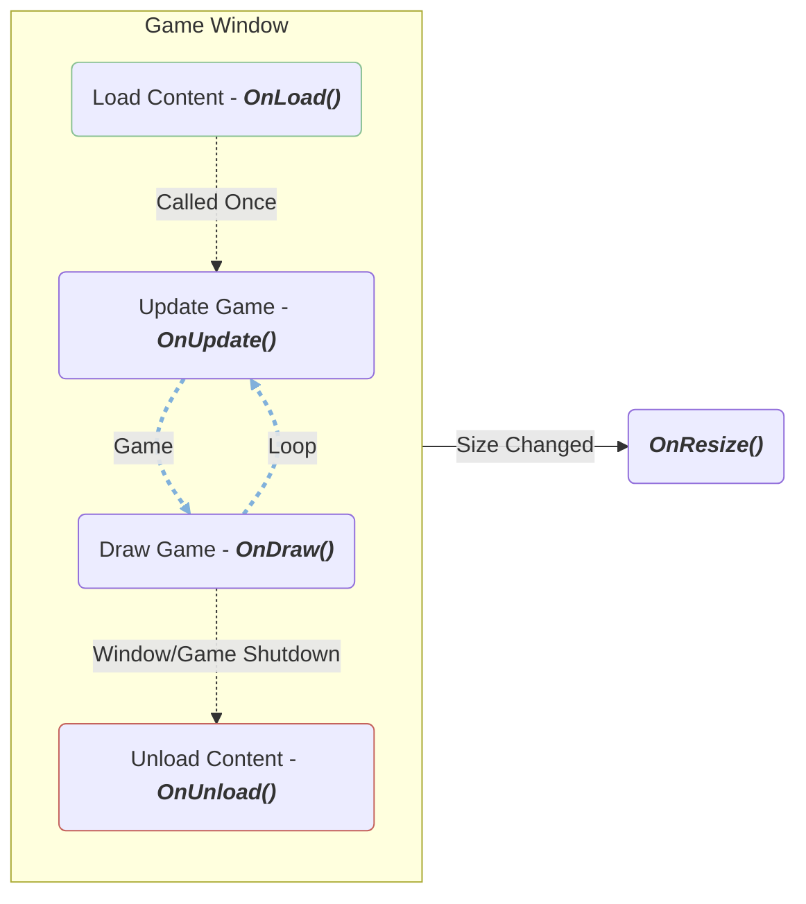

import Url from "@site/src/components/Url";

# Game Window

The game window is where all of your game content is rendered
and where you interact with the game loop. The `Window` class provides a variety of properties and methods that give
you control over the appearance, behavior, and lifecycle of your game.

When you create a game with **Velaptor**, you inherit from the `Window` class to create your own game class.

```csharp
public class Game : Window
{
}
```

:::note Refer To Guide
For more info on setting up a project, refer to the [Project Setup](./project-setup/project-template-setup) guide.
:::


## <span className="color-step">Window Settings</span>

The `Window` class comes with many settings you can configure to customize the behavior and appearance of your game window.
These can be set in the constructor of your game class or changed at any time during runtime.

### <span className="color-sub-step">Window title</span>

The `Title` property sets the text displayed in the title bar of the window. This is typically the name of your game.

```csharp
public Game()
{
    Title = "My Awesome Game";
}
```

### <span className="color-sub-step">Window position and state</span>

You can control where the window appears on the screen using the `Position` property. This is a `Vector2`
that represents the X and Y coordinates of the top-left corner of the window.

```csharp
public Game()
{
    Position = new System.Numerics.Vector2(100, 100);
}
```

The `WindowState` property controls the state of the window. It uses the `StateOfWindow` enum, which has the following values:

| Value | Description |
|---|---|
| `Normal` | The window is in its normal state. |
| `Minimized` | The window is minimized to the taskbar. |
| `Maximized` | The window covers the entire working area (excluding the taskbar). |
| `FullScreen` | The window covers the entire screen including the taskbar. |

```csharp
public Game()
{
    WindowState = StateOfWindow.Normal;
}
```

### <span className="color-sub-step">Window border</span>

The `TypeOfBorder` property determines the type of border the window has. It uses the `WindowBorder` enum:

| Value | Description |
|---|---|
| `Resizable` | The window border is resizable by the user or programmatically. |
| `Fixed` | The window border is fixed and can only be resized programmatically. |
| `Hidden` | The window has no visible border and can only be resized programmatically. |

```csharp
public Game()
{
    TypeOfBorder = WindowBorder.Resizable;
}
```

### <span className="color-sub-step">Update frequency and FPS</span>

The `UpdateFrequency` property controls how often the update and render calls are invoked, measured in hertz (Hz).
The default value is `60`, which means the game loop runs 60 times per second.

```csharp
public Game()
{
    UpdateFrequency = 60; // 60 frames per second
}
```

The `Fps` property is a read-only value that returns the actual number of frames per second the game loop is currently running at.
This is useful for debugging and performance monitoring.

:::tip
Press `Ctrl + Shift + Alt + S` in a running **Velaptor** application to toggle the stats window overlay,
which displays the current FPS.
:::

### <span className="color-sub-step">Mouse cursor visibility</span>

The `MouseCursorVisible` property controls whether the system mouse cursor is visible when hovering over the game window.
You might want to hide it if your game uses a custom cursor or if the cursor is not needed.

```csharp
public Game()
{
    MouseCursorVisible = false; // Hide the system cursor
}
```

### <span className="color-sub-step">Auto buffer clearing</span>

The `AutoClearBuffer` property determines whether the rendering buffers are automatically cleared before each frame.
When set to `true`, you do not need to manually invoke `IBatcher.Clear()`.

```csharp
public Game()
{
    AutoClearBuffer = true;
}
```

:::caution Warning
Do not manually clear the buffer **and** set `AutoClearBuffer` to `true` at the same time.
Doing both wastes resources since the buffer would be cleared twice per frame.
:::

### <span className="color-sub-step">Auto scene settings</span>

When using the built-in scene manager, **Velaptor** can automatically handle loading, unloading, updating,
and rendering of scenes for you. These settings are all `true` by default.

| Property | Description |
|---|---|
| `AutoSceneLoading` | Automatically loads scenes when they are added or activated. |
| `AutoSceneUnloading` | Automatically unloads scenes when they are removed or deactivated. |
| `AutoSceneUpdating` | Automatically calls the update logic for the active scene each frame. |
| `AutoSceneRendering` | Automatically calls the render logic for the active scene each frame. |

If you want full manual control over the scene lifecycle, you can disable any of these:

```csharp
public Game()
{
    AutoSceneLoading = false;
    AutoSceneUnloading = false;
    AutoSceneUpdating = false;
    AutoSceneRendering = false;
}
```

:::info When to disable auto scene settings
<details>
	<summary>Expand me to learn more!</summary>

Disabling one or more of these settings gives you manual control over the scene lifecycle. This is useful when you need to:

- **Load content at specific times** — For example, showing a loading screen while content loads in the background.
- **Control rendering manually** — If `AutoSceneRendering` is `false`, you must use `IBatcher.Begin()` and `IBatcher.End()` yourself.
- **Transition between scenes** — For custom transitions, you might want to control exactly when scenes are loaded and unloaded.
- **Optimize performance** — Only update or render scenes when necessary rather than every frame.

For most games, the default auto settings work well. Only disable them when you have a specific need for manual control.
</details>
:::

### <span className="color-sub-step">Combining settings</span>

In practice, you will typically set multiple properties together in the constructor of your game class:

```csharp
public Game()
{
    Title = "My Awesome Game";
    Width = 1280;
    Height = 720;
    UpdateFrequency = 60;
    TypeOfBorder = WindowBorder.Resizable;
    MouseCursorVisible = true;
}
```


## <span className="color-step">Game Loop Lifecycle</span>

The game loop is the core of any game. It is a continuous cycle that processes input, updates game state,
and renders content to the screen. **Velaptor** provides lifecycle methods that you can override
to hook into different stages of this loop.

Here is a diagram showing the lifecycle of a **Velaptor** game:



### <span className="color-sub-step">OnLoad()</span>

The `OnLoad()` method is invoked **once** when the window first starts up. This is where you load content such as
textures, fonts, sounds, and any other resources your game needs.

```csharp
protected override void OnLoad()
{
    // Load your content here
    base.OnLoad();
}
```

:::tip
Always call `base.OnLoad()` at the end of your override. This ensures that the built-in scene manager
loads scene content automatically when `AutoSceneLoading` is `true`.

Remember, if `AutoSceneLoading` is disabled, you must manually load scenes in your overridden `OnLoad()` method.
:::

### <span className="color-sub-step">OnUpdate(FrameTime)</span>

The `OnUpdate()` method is invoked **every frame** and always **before** `OnDraw()`. This is where you place your
game logic — updating positions, processing input, running physics, checking collisions, and managing game state.

The `FrameTime` parameter provides timing information:
- `ElapsedTime` — The time that has passed for the current frame.
- `TotalTime` — The total time the application has been running.

```csharp
protected override void OnUpdate(FrameTime frameTime)
{
    // Update game logic here
    var delta = (float)frameTime.ElapsedTime.TotalSeconds;

    base.OnUpdate(frameTime);
}
```

### <span className="color-sub-step">OnDraw(FrameTime)</span>

The `OnDraw()` method is invoked **every frame** and always **after** `OnUpdate()`. This is **only** for rendering
content to the screen. Keep game logic out of this method.

```csharp
protected override void OnDraw(FrameTime frameTime)
{
    this.batcher.Begin();

    // Render your content here

    this.batcher.End();

    base.OnDraw(frameTime);
}
```

:::caution NOT USING THE BATCHER
If you call a render method before `IBatcher.Begin()` or after `IBatcher.End()`, you will get an exception.
All rendering calls must be placed between `Begin()` and `End()`.
:::

### <span className="color-sub-step">OnUnload()</span>

The `OnUnload()` method is invoked **once** when the window is closed. This is where you clean up resources,
unload content, and free memory.

```csharp
protected override void OnUnload()
{
    this.contentManager.Unload(this.myTexture);
    base.OnUnload();
}
```

:::tip
Always call `base.OnUnload()` at the end of your override to ensure that the scene manager
properly unloads scene content when `AutoSceneUnloading` is `true`.

Remember, if `AutoSceneUnloading` is disabled, you must manually unload scenes in your overridden `OnUnload()` method.
:::

### <span className="color-sub-step">OnResize(SizeU)</span>

The `OnResize()` method is invoked any time the window's size changes. This includes minimizing, maximizing,
restoring, and manually resizing the window. The `SizeU` parameter contains the new `Width` and `Height` of the window.

```csharp
protected override void OnResize(SizeU size)
{
    // React to window size changes
    base.OnResize(size);
}
```

:::info Practical uses for OnResize
<details>
	<summary>Expand me to learn more!</summary>

Here are some examples of what you might do in `OnResize()`:

- **Pause the game** when the window is minimized.
- **Adjust the camera or viewport** to fit the new window dimensions.
- **Reposition UI elements** so they stay aligned to edges or corners.
- **Scale content** to maintain consistent visuals at different resolutions.

</details>
:::

### <span className="color-sub-step">Delegate-based hooks</span>

In addition to the virtual methods above, the `IWindow` interface exposes delegate properties that serve the same purpose.
These are useful when you are working with the `IWindow` interface directly instead of subclassing `Window`.

| Delegate | Equivalent Method | Description |
|---|---|---|
| `Initialize` | `OnLoad()` | Invoked once to initialize the window. |
| `Uninitialize` | `OnUnload()` | Invoked once to uninitialize the window. |
| `Update` | `OnUpdate()` | Invoked per frame for updating game logic. |
| `Draw` | `OnDraw()` | Invoked per frame for rendering. |
| `WinResize` | `OnResize()` | Invoked when the window is resized. |

The `Initialized` property is a read-only `bool` that indicates whether the window has completed initialization.

:::note
When subclassing the `Window` class, you will typically use the virtual method overrides (`OnLoad`, `OnUpdate`, etc.)
rather than the delegate properties. The delegates are wired internally to call the virtual methods.
If you set any of the lifecycle delegates directly, it will override the corresponding virtual method behavior,
which will prevent the overrides from being called.
:::


## <span className="color-step">Window Size</span>

Managing the size of your game window is important for providing a good player experience. **Velaptor** gives you
control over the window dimensions and the ability to react to size changes.

### <span className="color-sub-step">Width and Height</span>

The `Width` and `Height` properties control the dimensions of the game window in pixels. Both are of type `uint`.

```csharp
public Game()
{
    Width = 1280;
    Height = 720;
}
```

You can also read or change these values at runtime:

```csharp
protected override void OnUpdate(FrameTime frameTime)
{
    // Dynamically resize the window
    if (someCondition)
    {
        Width = 1920;
        Height = 1080;
    }

    base.OnUpdate(frameTime);
}
```

### <span className="color-sub-step">Responding to size changes</span>

When the window is resized — whether by the user dragging the edges, maximizing, minimizing, or through code —
the `OnResize()` method is invoked with a `SizeU` value containing the new dimensions.

You can also use the `WinResize` delegate when working with `IWindow` directly:

```csharp
myWindow.WinResize = (SizeU newSize) =>
{
    // React to the new size
    Console.WriteLine($"New size: {newSize.Width}x{newSize.Height}");
};
```

:::warning
Be careful with the code you place in `OnResize()`. Since it can be called frequently during resizing, avoid heavy computations or resource loading here.
:::

:::tip
To prevent the user from resizing the window, set `TypeOfBorder` to `WindowBorder.Fixed` or `WindowBorder.Hidden`.
This ensures the window can only be resized programmatically.
:::


## <span className="color-step">Scene Manager</span>

The `Window` class provides a `SceneManager` property that gives you access to the built-in scene manager.
The scene manager handles scene transitions, content loading, unloading, updating, and rendering.

Scenes are a powerful way to organize your game into logical sections such as menus, levels, cutscenes, and more.

```csharp
protected override void OnLoad()
{
    SceneManager.AddScene(new MainMenuScene(), true);

    base.OnLoad();
}
```

:::note Refer To Guide
Scene management is a larger topic with its own detailed guide. For full information on how to create,
manage, and transition between scenes, refer to the [Scene Management](./scenes/scene-management) guide.
:::


## <span className="color-step">Showing and Closing the Window</span>

Once your game class is ready, you need to show the window to start the game loop. **Velaptor** provides
multiple ways to do this.

### <span className="color-sub-step">Show()</span>

The `Show()` method opens the window and starts the game loop on the current thread. This is the simplest
way to run your game and the most common. The call blocks until the window is closed.

```csharp
var game = new Game();
game.Show();

// code here will not execute until the window is closed
```

### <span className="color-sub-step">ShowAsync()</span>

The `ShowAsync()` method opens the window and runs the game loop on a separate thread. This is useful
when you need to perform additional work after the window starts, or when integrating with async workflows.

It accepts two optional callbacks:
- `afterStart` — Invoked after the window has started.
- `afterUnload` — Invoked after the window has been unloaded.

```csharp
var game = new Game();
await game.ShowAsync(
    afterStart: () => Console.WriteLine("Game started!"),
    afterUnload: () => Console.WriteLine("Game closed!")
);
```

:::tip
Using `await` with `ShowAsync()` ensures the calling context waits until the window is closed, similar to how `Show()` blocks.
The game loop itself runs on a separate thread, which is useful when integrating with async workflows.
Just be mindful of thread safety when accessing shared resources between the game loop and other threads.

If you call `ShowAsync()` **without** `await`, the code after the call will continue executing immediately while the game runs.
In that case, you need to ensure the main thread stays alive for the duration of the game. One trick is to use
`Console.ReadLine()` after the `ShowAsync()` call to block the main thread, or have your own loop that performs
background tasks while the game is running.
:::


### <span className="color-sub-step">Close()</span>

The `Close()` method shuts down the game window. This triggers the `OnUnload()` lifecycle method, which
allows you to clean up resources before the window is destroyed.

```csharp
protected override void OnUpdate(FrameTime frameTime)
{
    if (shouldQuit)
    {
        Close();
    }

    base.OnUpdate(frameTime);
}
```

### <span className="color-sub-step">Dispose()</span>

The `Dispose()` method releases all resources held by the window. Since `Window` implements `IDisposable`, you
can also use a `using` statement to ensure proper cleanup:

```csharp
using var game = new Game();
game.Show();
```

You do not need to call `Dispose()` directly when using a `using` statement,
since it will automatically call `Dispose()` when the game object goes out of scope.

:::tip Best practice
Using the `using` statement ensures that `Dispose()` is called automatically when the game object goes out of scope,
even if an exception occurs. This is the recommended pattern for most applications.
:::


## <span className="color-step">Putting It All Together</span>

Here is a complete example that demonstrates many of the features covered in this guide:

```csharp
using Velaptor;
using Velaptor.Batching;
using Velaptor.Factories;
using Velaptor.UI;

public class Game : Window
{
    private readonly IBatcher batcher;

    public Game()
    {
        Title = "Game Window Guide";
        Width = 800;
        Height = 600;
        UpdateFrequency = 60;
        TypeOfBorder = WindowBorder.Resizable;
        MouseCursorVisible = true;

        this.batcher = RendererFactory.CreateBatcher();
    }

    protected override void OnLoad()
    {
        // Load textures, fonts, sounds, etc.
        base.OnLoad();
    }

    protected override void OnUpdate(FrameTime frameTime)
    {
        // Update game logic, process input, etc.
        base.OnUpdate(frameTime);
    }

    protected override void OnDraw(FrameTime frameTime)
    {
        this.batcher.Begin();

        // Render textures, text, shapes, etc.

        this.batcher.End();

        base.OnDraw(frameTime);
    }

    protected override void OnResize(SizeU size)
    {
        // React to the window being resized
        base.OnResize(size);
    }

    protected override void OnUnload()
    {
        // Unload content and clean up resources
        base.OnUnload();
    }
}
```

And the entry point:

```csharp
using var game = new Game();
game.Show();
```
